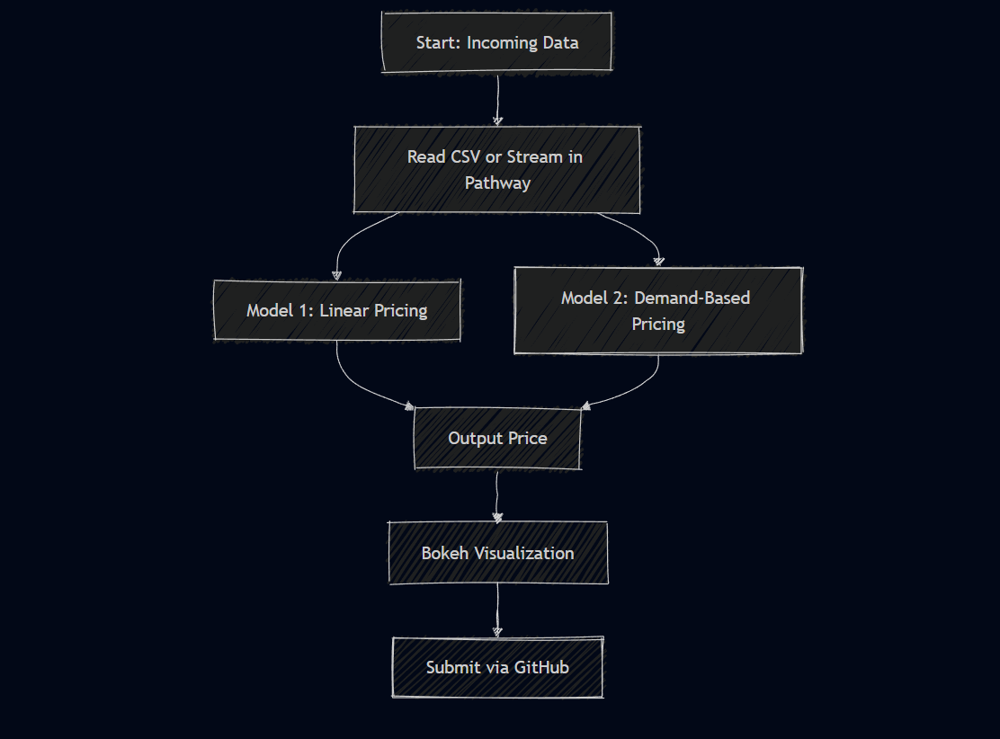

# 🚗 Dynamic Pricing for Urban Parking Lots

Capstone project submission for **Summer Analytics 2025**  
By **Ankit Kumar**

---

## 📁 Files

- `Dynamic_Pricing_Ankit_Kumar_SA2025.ipynb`  
  → Main notebook containing:
  - Model 1: Linear pricing
  - Model 2: Demand-based pricing
  - Bokeh visualizations
  - Full explanation and logic

---

## 📊 Models Implemented

- **Model 1 – Linear Pricing**  
  Price increases based on occupancy level  
  \[
  \text{Price}_{t+1} = \text{Price}_t + \alpha \cdot \left(\frac{\text{Occupancy}}{\text{Capacity}}\right)
  \]

- **Model 2 – Demand-Based Pricing**  
  Price changes based on:
  - Occupancy rate
  - Queue length
  - Traffic condition
  - Special day indicator
  - Vehicle type

  \[
  \text{Price} = \text{BasePrice} \cdot \left(1 + \lambda \cdot \text{NormalizedDemand}\right)
  \]

- **(Optional) Model 3 – Competitive Pricing**  
  Can be added to factor in nearby parking lot prices using geo-distance (not implemented here)

---

## 📈 Visualization

- Real-time simulation of pricing behavior using **Bokeh**
- Shows how price varies at different time steps using sample parking lot data

---

## ⚙️ Tech Stack

- Python
- Pandas, NumPy
- Bokeh (for graph plotting)
- Pathway (optional, for real-time streaming)

---

## 🧱 Architecture Diagram

This diagram shows the workflow from data input to price visualization:

---

## 🔁 Project Workflow Summary

1. Read data from CSV (simulating real-time input)
2. Process key features: occupancy, queue, traffic, etc.
3. Apply Model 1 and Model 2 logic to compute price
4. Normalize and bound price within logical limits
5. Visualize price over time using Bokeh
6. (Optional) Add rerouting or competitor pricing logic

---

## 📄 Report (Optional)

A detailed report can be added as `Final_Report.pdf` (not submitted here, as everything is inside the notebook).

---

## ✅ Author

**Ankit Kumar**  
Capstone Project for:  
📊 Consulting & Analytics Club × 🧠 Pathway  
**Summer Analytics 2025**
